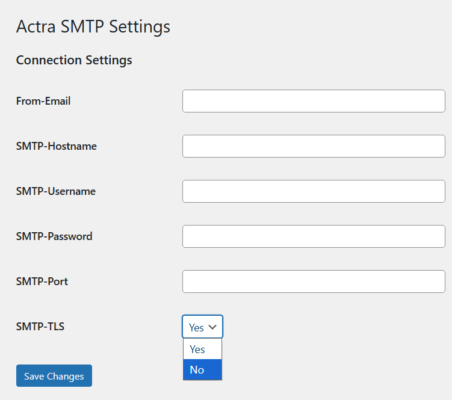

# Actra SMTP

A minimal, object-oriented SMTP plugin for WordPress with zero external dependencies.

## Overview

Actra SMTP is built for developers who prioritize clean code and performance. It bridges the gap between WordPress's core mailing functionality and your SMTP provider without the bloat of traditional SMTP plugins.

### Key Features

#### Smart Defaults
The plugin defaults to port 587, the industry standard for secure SMTP, making it "plug-and-play" for most modern hosting environments.

- **Zero External Dependencies**: No Composer, no vendor folders, no external libraries.
- **Modern PHP**: Written for PHP 8.0+ using named arguments and strict typing.
- **Minimal OOP Footprint**: Lightweight PSR-4 autoloader and a singleton-based core.
- **Developer Friendly**: Cleanly namespaced and easy to extend.

## Installation

1. Download or clone the repository into your `wp-content/plugins/` directory.
2. Ensure the folder name is `actra-smtp`.
3. Activate the plugin in the WordPress Admin.
4. Go to **Settings > Actra SMTP** to enter your credentials.

## Configuration

The plugin provides fields for:
- **From-Email**: The email address used as the sender.
- **SMTP Hostname**: Your SMTP provider's host (e.g., `smtp.example.com`).
- **SMTP Username/Password**: Your authentication credentials.
- **SMTP Port**: Usually `587` (TLS) or `465` (SSL).
- **SMTP-TLS**: Toggle between Yes (TLS) or No.

## Developer Notes

This plugin is built with a custom autoloader found in `includes/Autoloader.php`. To add new functionality, simply add classes to the `includes/` directory using the `Actra\Smtp` namespace.

---

*Created by [Actra AG](https://www.actra.ch)*
