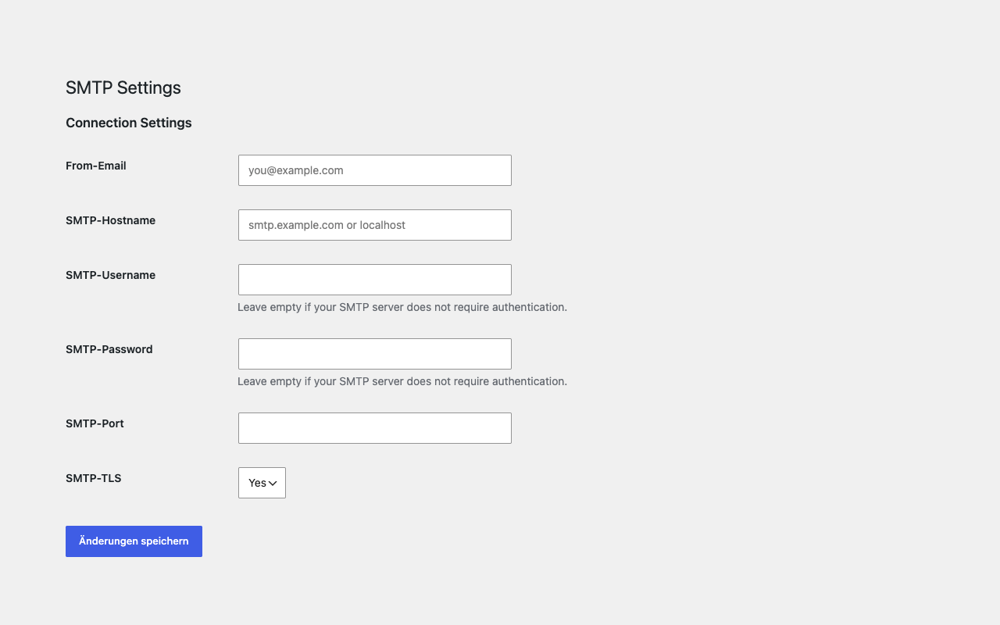

# Actra SMTP

[](https://www.gnu.org/licenses/gpl-2.0.html)

A minimal, object-oriented SMTP plugin for WordPress with zero external dependencies.



## Overview

Actra SMTP is built for developers who prioritize clean code and performance. It bridges the gap between WordPress's
core mailing functionality and your SMTP provider without the bloat of traditional SMTP plugins.

### Key Features

#### Smart Defaults

The plugin defaults to port 587, the industry standard for secure SMTP, making it "plug-and-play" for most modern
hosting environments.

- **Zero External Dependencies**: No Composer, no vendor folders, no external libraries.
- **Modern PHP**: Written for PHP 8.0+ using named arguments and strict typing.
- **Minimal OOP Footprint**: Lightweight PSR-4 autoloader and a singleton-based core.
- **Developer Friendly**: Cleanly namespaced and easy to extend.

## Installation

1. Download or clone the repository into your `wp-content/plugins/` directory.
2. Ensure the folder name is `actra-smtp`.
3. Activate the plugin in the WordPress Admin.
4. Go to **Settings > Actra SMTP** to enter your credentials.

## Configuration

The plugin provides fields for:

- **From-Email**: The email address used as the sender.
- **SMTP Hostname**: Your SMTP provider's host (e.g., `smtp.example.com`).
- **SMTP Username/Password**: Your authentication credentials.
- **SMTP Port**: Usually `587` (TLS) or `465` (SSL).
- **SMTP-TLS**: Toggle between Yes (TLS) or No.

### Password storage

Actra SMTP does not display the saved SMTP password in the WordPress admin area.

When a password is saved through **Settings > Actra SMTP**, it is stored encrypted in the WordPress database. Existing
plaintext passwords from older versions remain supported and are used as a backwards-compatible fallback.

To avoid storing the SMTP password in the database, you can define it in `wp-config.php` instead:

```php
define('ACTRA_SMTP_PASSWORD', 'your-smtp-password');
```

Place the constant above this line in `wp-config.php`:

```php
/* That's all, stop editing! Happy publishing. */
```

When `ACTRA_SMTP_PASSWORD` is defined, it takes priority over the database value and the password field in the plugin
settings screen cannot be changed.

For local environments that do not require an SMTP password, you may intentionally define an empty password:

```php
define('ACTRA_SMTP_PASSWORD', '');
```

### Password priority

The final SMTP password is resolved in this order:

1. `ACTRA_SMTP_PASSWORD` from `wp-config.php`, if the constant is defined.
2. The encrypted password stored in the WordPress database.
3. A legacy plaintext database password, for backwards compatibility.

## Developer Notes

This plugin is built with a custom autoloader found in `includes/Autoloader.php`. To add new functionality, simply add
classes to the `includes/` directory using the `Actra\Smtp` namespace.

---

*Created by [Actra AG](https://www.actra.ch)*
